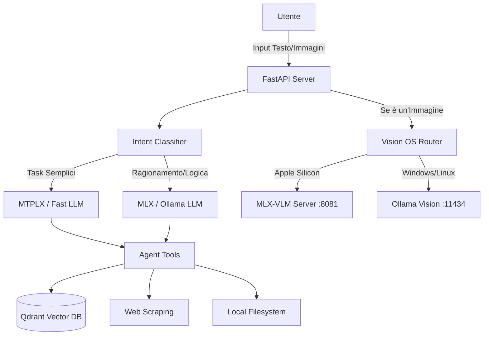

<div align="center">
  <h1>🛸 AI Agent OS</h1>
  <p><b>Il tuo Sistema Operativo AI Personale 100% Locale, Autonomo e Multi-Piattaforma</b></p>
  
  [](https://github.com/virgillito-tech/AI-Agent-OS/actions/workflows/release.yml)
  [](#)
  [](#)
  [](#)
</div>

---

## 🧠 Cos'è AI Agent OS?

**AI Agent OS** non è un semplice chatbot. È un vero e proprio "Sistema Operativo" governato dall'Intelligenza Artificiale, progettato con un'architettura **ReAct** (Reasoning and Acting) avanzata tramite **LangGraph**. 

A differenza dei sistemi cloud-based (come ChatGPT o Claude), AI Agent OS gira **completamente in locale** sul tuo hardware, garantendo privacy assoluta (0% dei tuoi dati lascia il tuo computer). È capace di interagire fisicamente con l'ambiente desktop, manipolare file, leggere il web, gestire email e analizzare immagini autonomamente, operando con un sistema a privilegi controllati (Sandbox e Jailbreak mode).

## 🌟 Caratteristiche Tecniche Principali

* ⚡ **Eseguibili Standalone (Nessuna dipendenza richiesta)**
  Il sistema viene compilato automaticamente in applicazioni singole (`.exe` per Windows, binari nativi per macOS e Linux) tramite pipeline CI/CD con GitHub Actions. Gli utenti finali devono solo fare doppio clic per avviare l'agente.
* 👁️ **Visione Ibrida OS-Aware (Novità v1.0)**
  Il sistema riconosce automaticamente l'hardware su cui sta girando:
  * **macOS (Apple Silicon)**: Inizializza un demone dedicato basato su `mlx-vlm` (usando modelli come Qwen2-VL) su porta isolata per un'elaborazione ultraveloce e nativa delle immagini su GPU Metal, senza collidere con il modello testuale principale.
  * **Windows / Linux**: Esegue un fallback intelligente sul demone **Ollama** per sfruttare l'accelerazione CUDA locale.
* 🧠 **Orchestratore di Motori Dinamico**
  Il sistema non usa un solo LLM, ma un **Orchestratore** in-memory ultraveloce (3B parameters) che classifica i tuoi intenti e "risveglia" il motore più adatto:
  * *Motore Fast (MTPLX)*: Per ricerche web, chiamate di sistema e tool-calling (es. Qwen 3.5).
  * *Motore Reasoning (MLX/Ollama)*: Per task di logica complessa, generazione codice e matematica profonda (es. Gemma 4 / DeepSeek).
* 🚀 **TurboQuant & Speculative Decoding**
  Integra le ultime tecnologie di inferenza Apple Silicon: quantizzazione a 4-bit, ottimizzazione della cache KV e **Speculative Decoding** ibrido per decuplicare la velocità di generazione.
* 🛠️ **Ecosistema di Tool ReAct**
  L'agente può:
  * Effettuare ricerche web live e fare scraping invisibile (Playwright/Telethon).
  * Gestire email (SMTP) e analizzare calendari Apple iCloud/Google.
  * Sfruttare un database vettoriale locale (**Qdrant**) per Memoria RAG a lungo termine.

## 📥 Installazione per Utenti Finali (Standalone)

Non devi installare Python, librerie o compilare nulla!
1. Vai nella pagina **[Releases](https://github.com/virgillito-tech/AI-Agent-OS/releases)** di questo repository.
2. Scarica la versione adatta al tuo sistema operativo:
   * `AIAgentOS-Windows.exe` (Windows)
   * `AIAgentOS-macOS` (Mac Intel/Apple Silicon)
   * `AIAgentOS-Linux` (Ubuntu/Debian)
3. Esegui il file e l'OS si avvierà localmente all'indirizzo `http://127.0.0.1:8000`.

*(Nota: Al primissimo avvio l'app impiegherà alcuni istanti per estrarre il motore AI interno).*

## 💻 Installazione per Sviluppatori (Build from Source)

Vuoi modificare i tool o aggiungere nuove capacità all'agente?

1. **Clona la repository:**
   ```bash
   git clone https://github.com/virgillito-tech/AI-Agent-OS.git
   cd AI-Agent-OS
   ```
2. **Crea l'ambiente virtuale e installa le dipendenze:**
   ```bash
   python3 -m venv venv
   source venv/bin/activate
   pip install -r requirements.txt
   ```
3. **Avvia il server backend:**
   ```bash
   python main.py
   ```

*(Su macOS Apple Silicon, il sistema scaricherà automaticamente e userà i framework `mlx` e `mlx-vlm`. Su Windows/Linux sfrutterà `ollama` che deve essere preventivamente installato).*

## 🏗️ Architettura del Sistema



## 🔐 Privacy & Sicurezza
L'intero ciclo vitale dei dati elaborati in AI Agent OS (chat, file, chiavi API) avviene e muore sul tuo computer. Non ci sono server cloud intermedi. Per la sicurezza del file system, l'agente viene eseguito di default in una directory `sandbox/`, garantendo che non possa alterare file di sistema senza un esplicito *Jailbreak* da parte dell'utente.